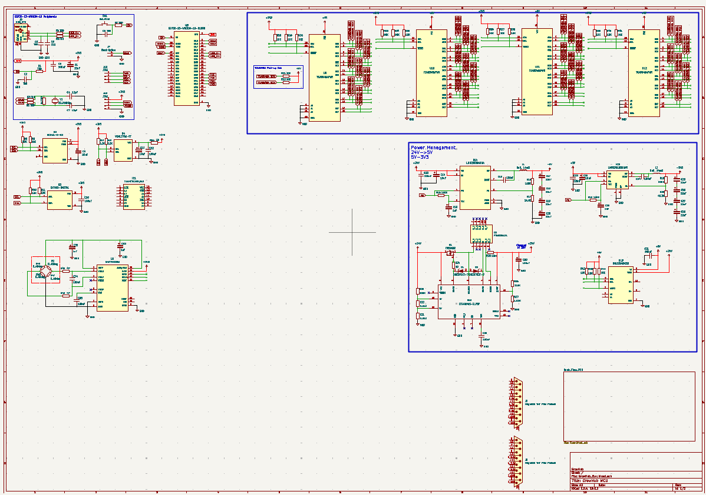
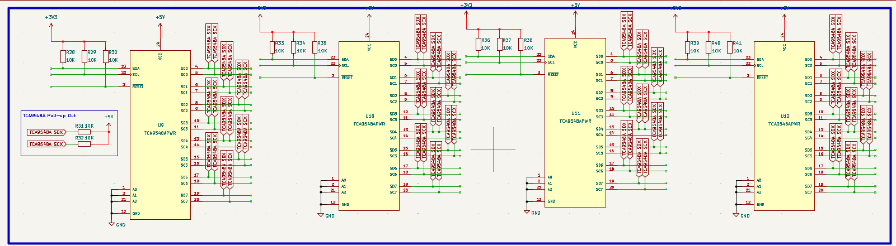
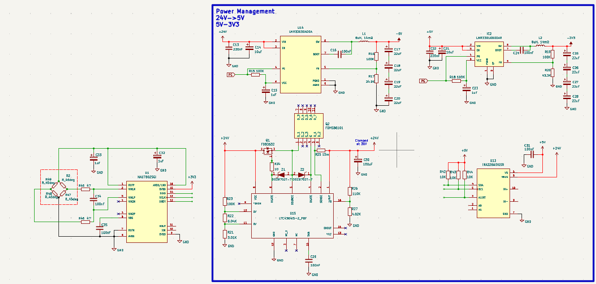
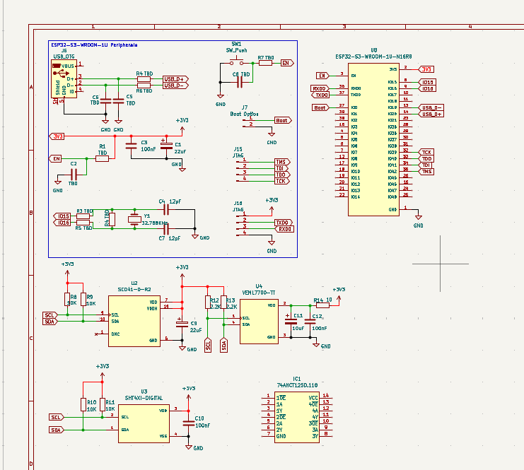
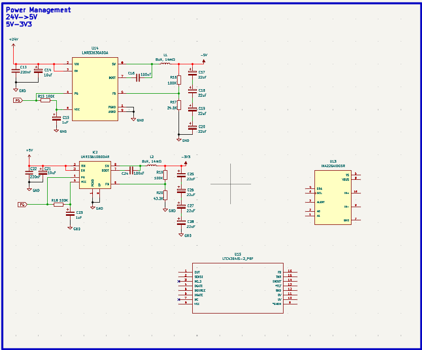
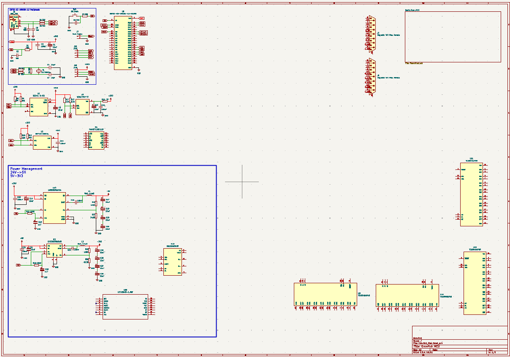
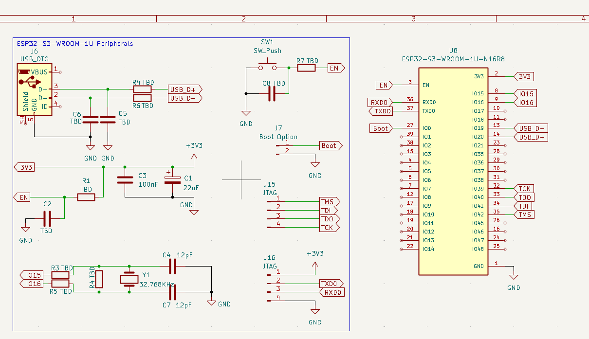
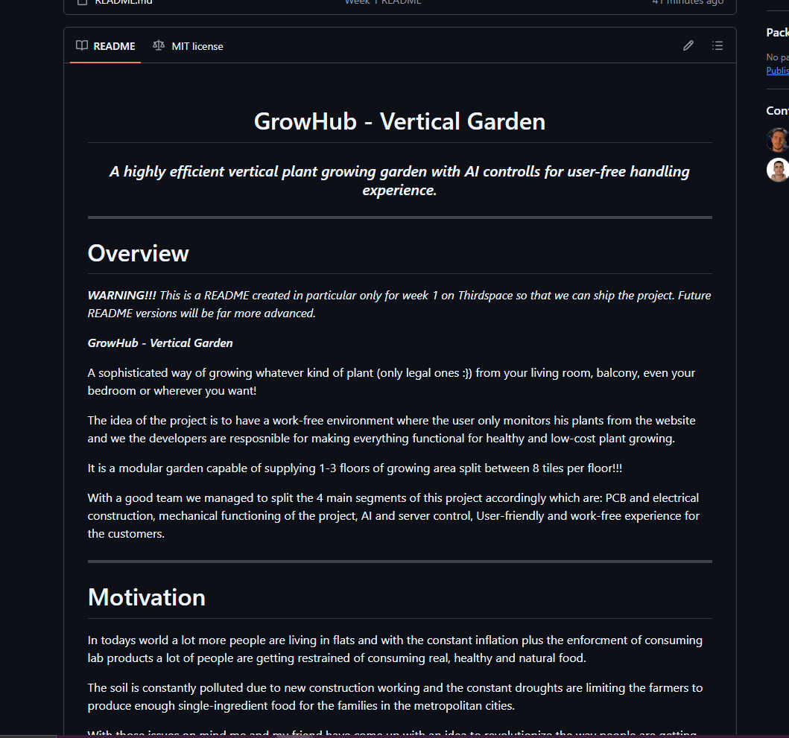
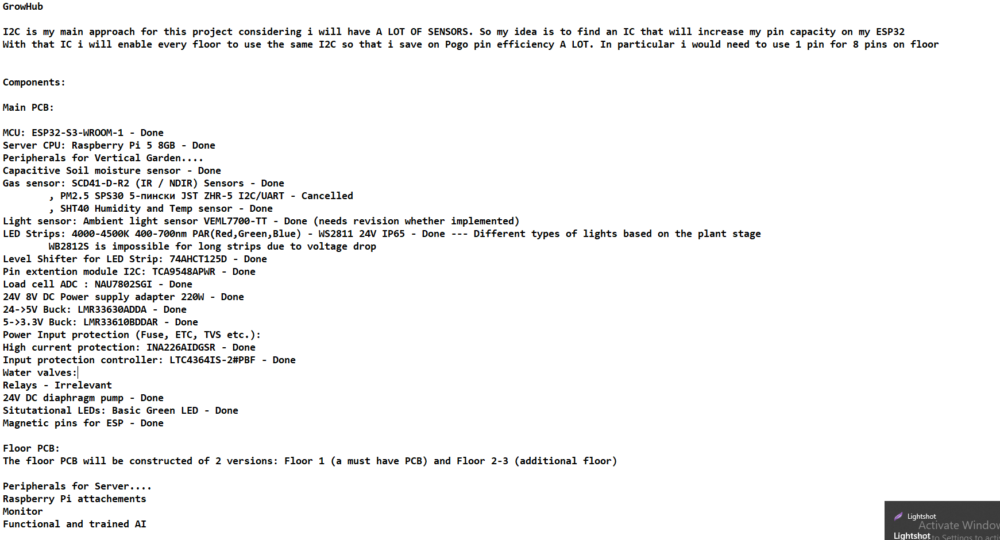
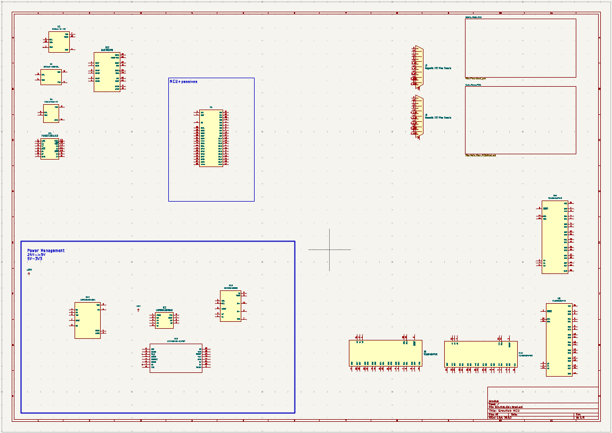

# GrowHub - Journal

- Author: ajakovski07

## 8. Timelapse - 24.09.2026

Grinded up a bit and i implemented a lot of schematic features. I am still lacking a couple of components tht me and my partner mentioned for this project so i am both implementing and building their environment for efficient workflow.

Also the schematic is starting to recieve its own sections and by the end of it i hope everything is nicely organized and easily readable.

---

**What i did:**

- Added a lot of peripheral components for my modules
- Started implementing new sensors and modules for the project

---

**Problems that i had:**

- Because we are planning on really making this project functional it is hard to know what is too much expensive so i am very often getting lost into how much should i target efficiency or budget-friendly

---

**Next step:**

- There is still a lot of components that need to be added
- A lot of peripheral working left
- Need to assign MCU pins

---

## 7. Timelapse - 23.09.2026

A pretty chill day if you ask me considering that i've only assembled passive components around and copied prefered schematics. Ofcourse these recommendations need to be tested at first but that will be possible only after i assign other components.

---

**What i did:**

- Finished a couple modules with their passive component structure

---

**Problems that i had:**

- I am not sure if i have every single passive component integration for the MCU, i will have to double check in my past project but so far it looks ok except the "TBD" value components

---

**Next step:**

- Continue working on the same thing that i am working right now
- Also integrate other peripherals into the schematic

---

## 6. Timelapse - 22.09.2026

Week one has ended!!! Honestly i think that i achieved my bare minimum and i hope that i beat the hour count this week. Even tho i've been up to a busy schedule with life I will try to do more than 12 hours.

We made a slight mistake by shipping it twice with individual screenshots and description so i hope that is not a problem :))))

Anyways here is what i did in this timelapse.

---

**What i did:**

- Started implementing passive components for the modules

---

**Problems that i've faced:**

- Nothing much except the fact that some components are not displayed with values so i will have to read docs while im not timelapsing....
- I forgot to transfer the newest schematic to GitHub and now because im working on my laptop (and not on my PC) because im in a different city i will have to transfer it via screenshare.

---

**Next step:**

- Start adding passive components to other modules

---

  
# ***END OF WEEK 1***

---

## 5. Timelapse - 20.09.2026

I've prepared everything for shipping for this week! A basic README has been constructed in order to have some meaningfull ship for the work that we managed to do in a matter of +20 hours of work on such a big and complex project so please take in notice that we haven't  made a functional project for Week 1.

---

**What i did:**

- Wrote README Week 1

---

**Current State:**

- Finished Week 1
- Ready to ship for a big project

---

**Next Step:**

- Start Week 2
- Have the first functional ship

---

## 4. Timelapse - 18.09.2026

Finally i've finished the component hunting for the main pcb *for now*. Saying for now is kinda sad considering i wasted so much time implementing them in kicad and avoiding the regulatory obligation that i can not read documentation while timelapsing and honestly i dont account this time as reading documentation because i've researched dozens of coponents in this hours so it is an efficient time spent working on a project.

---

**What i did:**

- Finalised the first hunt for components
- Made a clear path for a smooth work in KiCAD
- gathered documentation that will help while making the hardware

---

**Problems that i've faced:**

- A lot of components... I know that we still havent explained the project but its sooo complex that a lot of regulations and procedures are required.
- Super technical project

---

**Current State:**

- Ready for building the schematic
- Clear path to work on
- Ready to start working on the other 2 PCBs

---

**Next Step:**

- Agree what type of pump for watering we are gonna use with my teammate
- Start the schematic with passive components
- Create constraints and regulations for my KiCAD project

---

## 3. Timelapse - 17.09.2026

Im getting closer to finishing the main PCB component list. I've decided which input voltage i should use. I found every sensors that i need for the first version and now only power management section is left.

I plan for the first week to have every single component that i would need for the main PCB in order to supply the floors with the desired power/signal.

---

**What i did:**

- Finished input/output component selection.
- Found a 24V diaphragm water pump for our project.
- Assigned every component with its coresponding footprint in KiCAD.
- Fixed the issue with my MCU selection.
- Calculated critical power consumption components
- Improved the PCB concept of having 3 versions of PCBs for budget efficiency.

---

**Problems that i've faced:**

- None except the fact that some components caused me a headache whilst trying to find a footprint for them.
- A huge project causes so many aspects to be taken in notice so its really hard to decide where to work first.

--

**Current State:**

- Cleared a lot of uncertainties with the hardware aspect of the project
- Created a clear path for work behind the "scenes" (timelapsing) with my teammate
- Almost prepared my work on KiCAD

---

**Next Step:**

- Resolve the Power Management component question.
- Find watering components that accomodate 24V if possible
- Try and skip 12V in order to be efficient.

---

## 2. Timelapse - 16.09.2026

Component shopping!!!
Or more accurately the pain of not settling down with 1 module which was so disturbing because of the sheer spectrum that this project is consisted of. I've reserched a lot behind timelapse because i know reading documentation is forbiden but still i had jet lags while timelapsing because i was re-ordering my information in my head.

We've also discussed a lot on how to 3D model and implement the multi-PCB concept all in one so i am really excited so see what it is gonna look like.

---

**What i did:**
In this timelapse which lasted 2 days because yesterday i didnt manage to timelapse for another hour i intended on researching needed components and trying to find them. I am not a biology-person but I tried to research and implement every sensor that is needed for perfecting the growth of one plant.

Researched and read A LOT OF DOCUMENTATION behind timelapse so that i know a bit more about this project

---

**Problems that i've faced**

- A lot of sensors....
- I had so many options that i didnt know what to choose.
- I couldnt really show every work via timelapse becuase some of it was just brainstorming options inside of my head and writing it odwn in notepad in my components list
- The Magnetic Pogo wiring is still a problem and we will need to resolve it with my teammate.

---

**Current State:**

- I've almost picked every essential component that i need for start
- I have made a clear plan behind the scenes on how the electronic scheme should look like (visual imagination :)))
- I've redesigned the schematic and how i plan on doing it.

---

**Next Step:**

- Finish the essential component list
- Start the first version of the schematic.

---

## 1. Timelapse - 14.09.2026

Another project has been started in this organization with a lot of plans and goals that need to be accomplished. 

---

**What i did:**

- In this timelapse i did what every normal person (hopefully) would do when they start a project and that is to use your imagination in order to create a sketch that will guide you toward the end product.
- I also created the regular files that i need for shipping a project and prepared files for me and my friend while we journal.
- I have also started looking for components and finding the files for KiCad.
- Because i have been assigned for the hardware and embedded systems it is my job to work on the efficiency of the modules.

Now it's kinda different because i am participating in a team related project called Thirdspace so we have assigned eachother with separate work in order to complete this project:)))

---

**Problems that i've faced**

I fear that as always i will have problems with finding the files to implement into KiCAD and instead i will have to use connectors in order to immitate them.

Slight network problems were existent but that is not a project issue after all.

---

**Current State**

- The starting point has been created from my viewpoint and for my work
- I've prepared the repository for my friend to work inside it also
- Started the schematic
- Started searching for the components

---

**Next Step**

- Finish the component list atleast for 1 floor and basic MCU station
- Create a basic schematic
- Write an MVP code in ESP-IDF
- Test it at home

---
