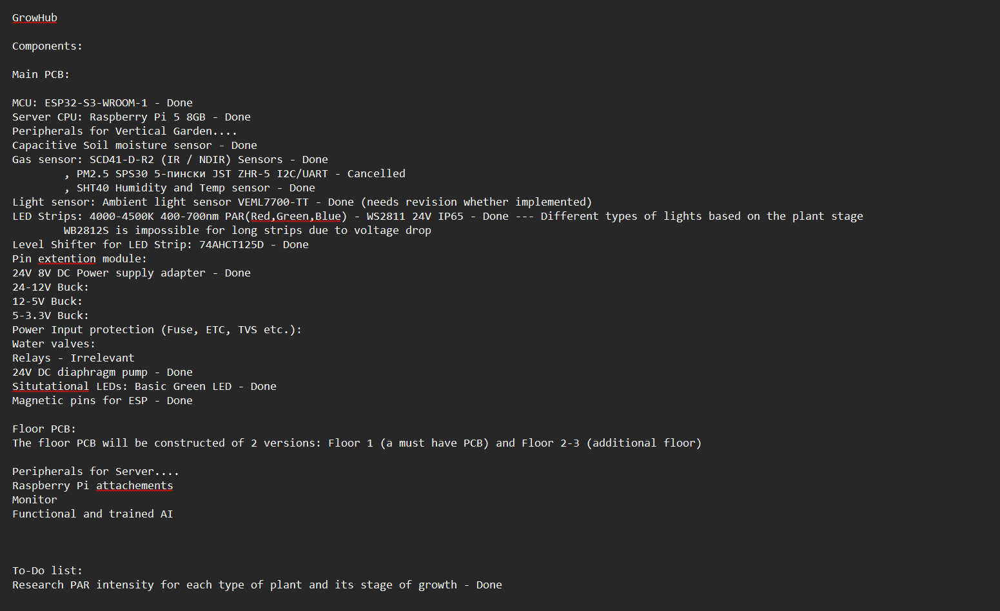
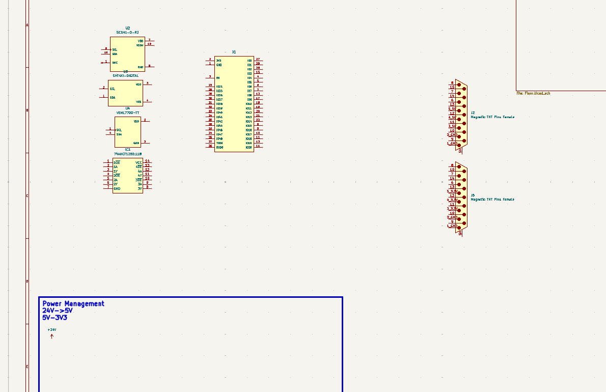
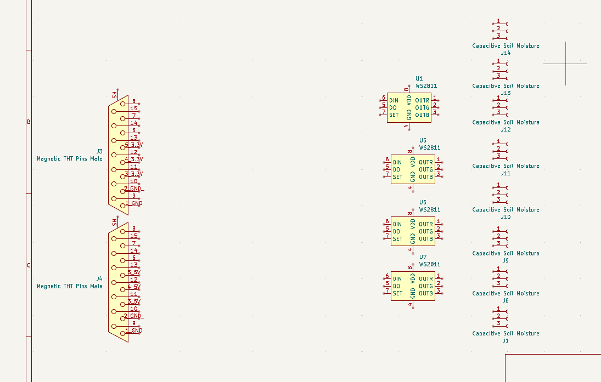
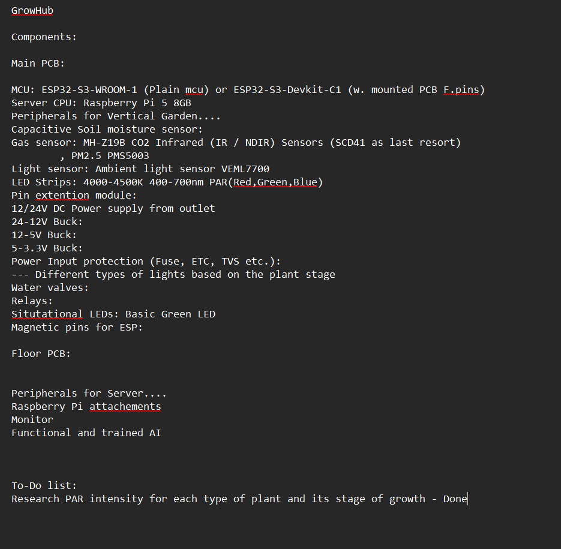
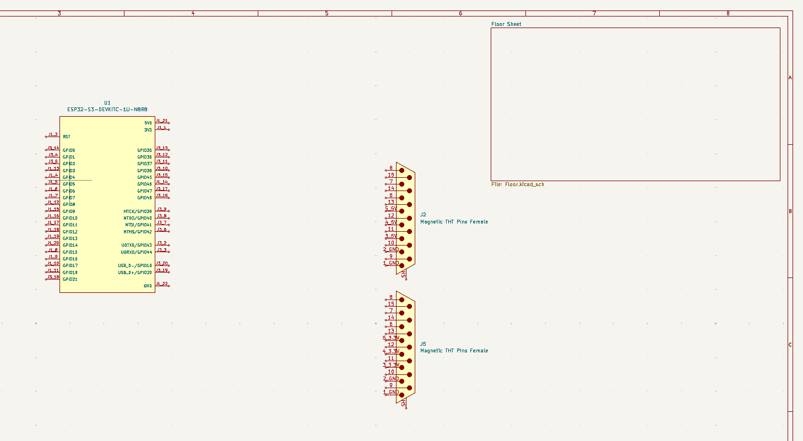
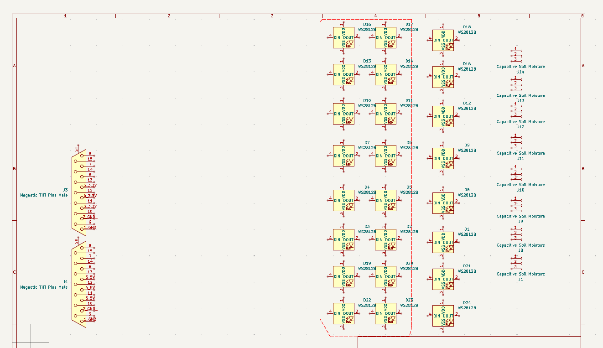
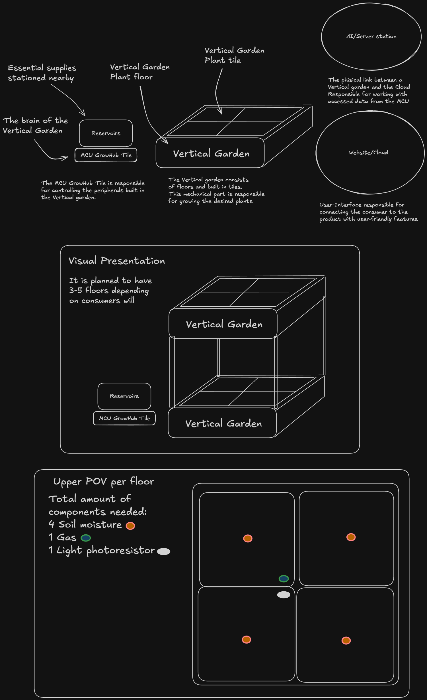
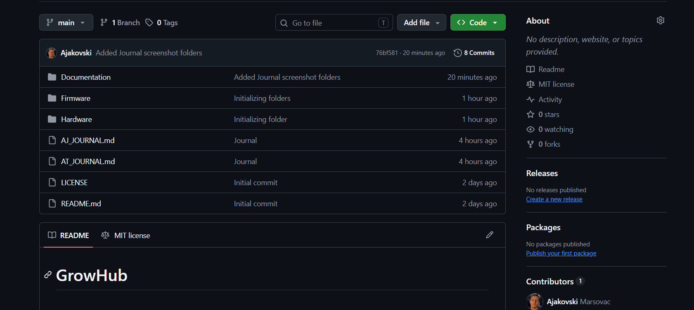
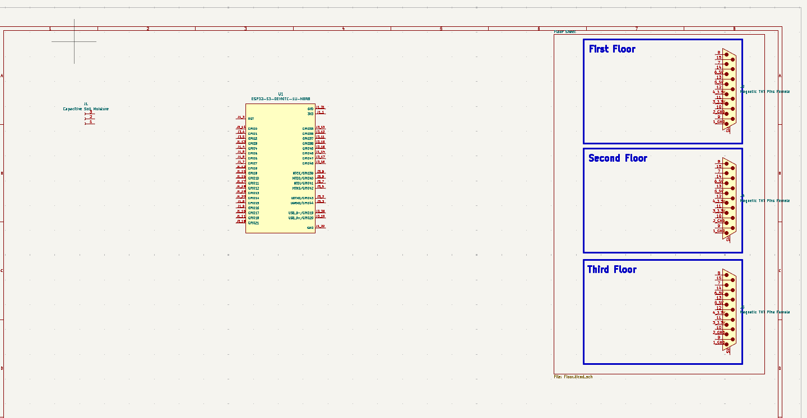

# GrowHub - Journal

- Author: ajakovski07

## 3. Timelapse - 17.09.2026

Im getting closer to finishing the main PCB component list. I've decided which input voltage i should use. I found every sensors that i need for the first version and now only power management section is left.

I plan for the first week to have every single component that i would need for the main PCB in order to supply the floors with the desired power/signal.

---

**What i did:**

- Finished input/output component selection.
- Found a 24V diaphragm water pump for our project.
- Assigned every component with its coresponding footprint in KiCAD.
- Fixed the issue with my MCU selection.
- Calculated critical power consumption components
- Improved the PCB concept of having 3 versions of PCBs for budget efficiency.

---

**Problems that i've faced:**

- None except the fact that some components caused me a headache whilst trying to find a footprint for them.
- A huge project causes so many aspects to be taken in notice so its really hard to decide where to work first.

--

**Current State:**

- Cleared a lot of uncertainties with the hardware aspect of the project
- Created a clear path for work behind the "scenes" (timelapsing) with my teammate
- Almost prepared my work on KiCAD

---

**Next Step:**

- Resolve the Power Management component question.
- Find watering components that accomodate 24V if possible
- Try and skip 12V in order to be efficient.

---

## 2. Timelapse - 16.09.2026

Component shopping!!!
Or more accurately the pain of not settling down with 1 module which was so disturbing because of the sheer spectrum that this project is consisted of. I've reserched a lot behind timelapse because i know reading documentation is forbiden but still i had jet lags while timelapsing because i was re-ordering my information in my head.

We've also discussed a lot on how to 3D model and implement the multi-PCB concept all in one so i am really excited so see what it is gonna look like.

---

**What i did:**
In this timelapse which lasted 2 days because yesterday i didnt manage to timelapse for another hour i intended on researching needed components and trying to find them. I am not a biology-person but I tried to research and implement every sensor that is needed for perfecting the growth of one plant.

Researched and read A LOT OF DOCUMENTATION behind timelapse so that i know a bit more about this project

---

**Problems that i've faced**

- A lot of sensors....
- I had so many options that i didnt know what to choose.
- I couldnt really show every work via timelapse becuase some of it was just brainstorming options inside of my head and writing it odwn in notepad in my components list
- The Magnetic Pogo wiring is still a problem and we will need to resolve it with my teammate.

---

**Current State:**

- I've almost picked every essential component that i need for start
- I have made a clear plan behind the scenes on how the electronic scheme should look like (visual imagination :)))
- I've redesigned the schematic and how i plan on doing it.

---

**Next Step:**

- Finish the essential component list
- Start the first version of the schematic.

---

## 1. Timelapse - 14.09.2026

Another project has been started in this organization with a lot of plans and goals that need to be accomplished. 

---

**What i did:**

- In this timelapse i did what every normal person (hopefully) would do when they start a project and that is to use your imagination in order to create a sketch that will guide you toward the end product.
- I also created the regular files that i need for shipping a project and prepared files for me and my friend while we journal.
- I have also started looking for components and finding the files for KiCad.
- Because i have been assigned for the hardware and embedded systems it is my job to work on the efficiency of the modules.

Now it's kinda different because i am participating in a team related project called Thirdspace so we have assigned eachother with separate work in order to complete this project:)))

---

**Problems that i've faced**

I fear that as always i will have problems with finding the files to implement into KiCAD and instead i will have to use connectors in order to immitate them.

Slight network problems were existent but that is not a project issue after all.

---

**Current State**

- The starting point has been created from my viewpoint and for my work
- I've prepared the repository for my friend to work inside it also
- Started the schematic
- Started searching for the components

---

**Next Step**

- Finish the component list atleast for 1 floor and basic MCU station
- Create a basic schematic
- Write an MVP code in ESP-IDF
- Test it at home

---
