# GrowHub - Journal

- Author: ajakovski07

## 15. TImelapse - 09.10.2026

Long time no see.... I had some personal issues both with my laptop and also other stuff that made me start this week all the way in Friday :/// Now i need to do atleast 11 hours by the end of Sunday. I hope that i am gonna achieve that because I am invited to 2 birthday parties.... Thats amusing right, IM GONNA OBLITERATE MYSELF.

Personally i think expressing my rage in journal is a fun thing if somebody ever decides to read it.

Anyways in this timelapse i FINALLY found the right MOSFETs and i started working on that logic section about the valves and LED control.

---

**What i did:**

- I had to make the main board schematic an A1 paper
- Added the needed MOSFETs
- Included other peripherals

---

**Problems that i've had:**

- Lagging on my PC which disrupted my work a couple times
- The schematic is getting messy now that i need to finalise everything

---

**Whats next:**

- I just need to finish off the connections on main board
- Finish off peripherals on Floor board

---

## 14. Timelapse - 04.10.2026

Finally finished my tournament and came back home to sleep and go to school in the different city tomorrow again... Anyways i tried making some hours from my laptop and i managed to fix some previous confusions about powering this project. Also me and my partner are thinking of changing the path of this project towards hydroponics meaning i might remove some components.

**What i did:**

- Fixed the powering input confusion
- Finalised power management sector
- Added more peripheral components

---

**Problems that occured:**

- Nothing pretty much except the touchpad on my laptop that made me slow

---

**Next Step:**

- I'm kinda mad at myself about the fact that i didnt finish the schematic this week but i think its understandable because some parts are really confusing to me as a student who is not a real engineer and tries to make this complex monstrousity.
- I really need to finish the schematic next week.
- I also need to assign every single MOSFET im missing a lot of them

---

## 13. Timelapse - 02.10.2026

Once again i am timelapsing late and sleepy but now with even worse condition and that was a bad WiFi....... I lowkey crashed out a couple times because the timelapse was running slow due to low internet connection and not being able to open anything. I did get a couple stuff sorted out tho :)))

---

**What i did:**

- I finally found good connectors. Honestly i had to search for them without timelapsing because i just couldnt find the appropriate one without taking too much time on timelapse.
- Improved the LDO for my basic floor.
- Added more wiring connections
- Added more peripherals

---

**Problems that i had:**

- The WiFi issues were SOOO ANNOYING. I hope that isnt a problem even though at the start it is super noticable that i ahd issues with loading pages.
- Because i am travelling its super hard for me to work like i am so tired.

--- 

**Whats next:**

- I think by the end of week i will have 90% done of the schematic which is amazing so that next week i can start the PCB as planned.
- We need to define the final way of water sourcing the floors and also to decide whether its hydroponics or basic watering system.

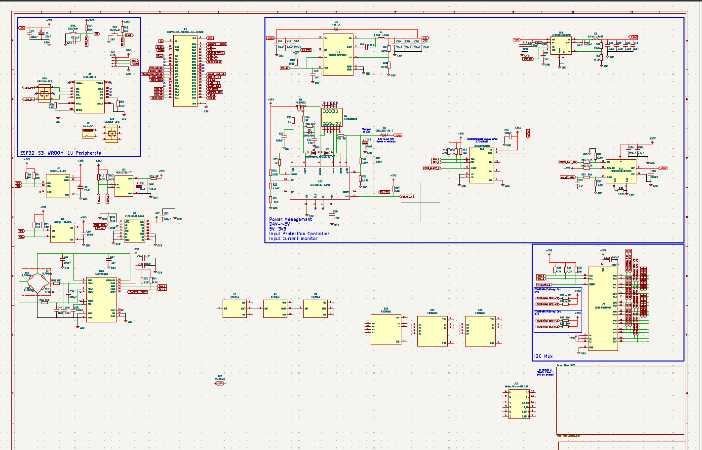
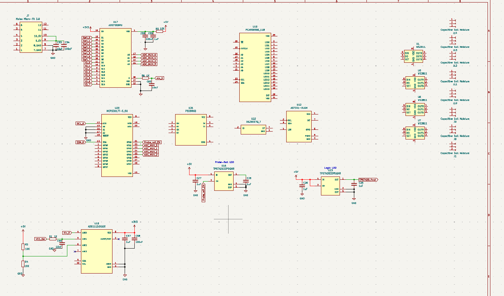

---

## 12. Timelapse - 01.10.2026

Im soooo sleeeepy.... I mightve zoned out while timelapsing so i must rewatch my timelapse and edit it. Anyways i did a couple stuff today and in particular i nit picked a couple more components for the project and added other new peripheral components. The work is really repeatable but i must do it now and not in the PCB construction process.

I also FINALLY ASSIGNED the MCU pins. That way i can more clearly and easily wire other modules.

---

**What i did:**

- Assigned the whole MCU pinout
- Added a couple components
- Added their peripheral components

---

**Problems that i had:**

- Figuring which schematic to follow for my MCU
- I am super sleepy and its past 1AM (3 hours past my bedtime) so pls dont get angry on my jetlagging while reviewing.

---

**Next step:**

- Im getting very close to finishing off the main board so i should aim to close that task
- Overall finish the schematic

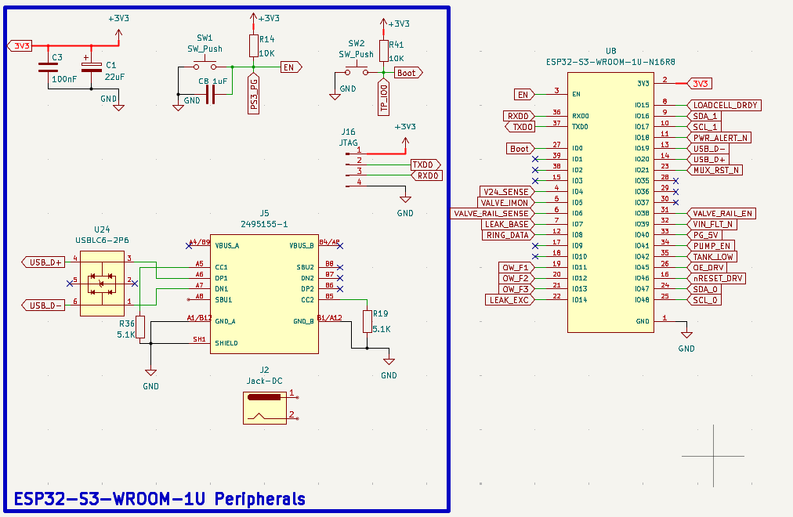
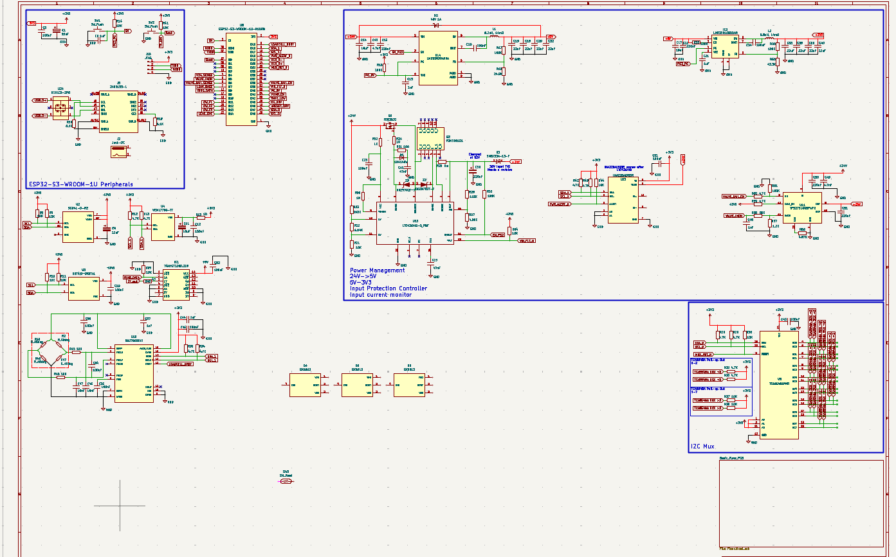
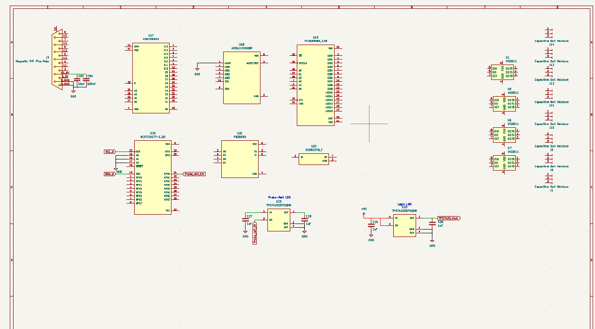

---

## 11. Timelapse - 30.09.2026

A busy day but still managed to get in 3 hours of timelaspse. The work was kinda slow at some periods but i think its understandable that not a single teenager can sort out this much components and pins really fast, sometimes i start jet lagging and it looks like i am AFKing but instead i am thinking about a different module thats not on the screen. Anyways i did manage to get some progress and im getting very sleepy.

---

**What i did:**

- Upgraded a lot of modules with peripheral schematic
- Added some missing components
- Started assigning GPIO pins

---

**Problems that i had:**

- I am struggling with finding a nice usb-c port. I reckon i might be searching for something non-existent because i am a perfectionist but by tomorrow i will surely decide at some part.

---

**Next step:**

- Continue with what im doing lowkey

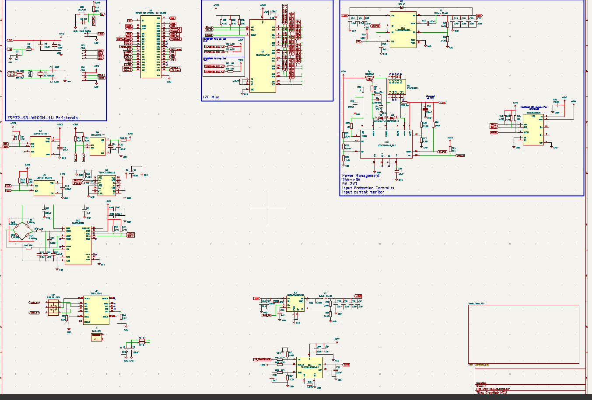
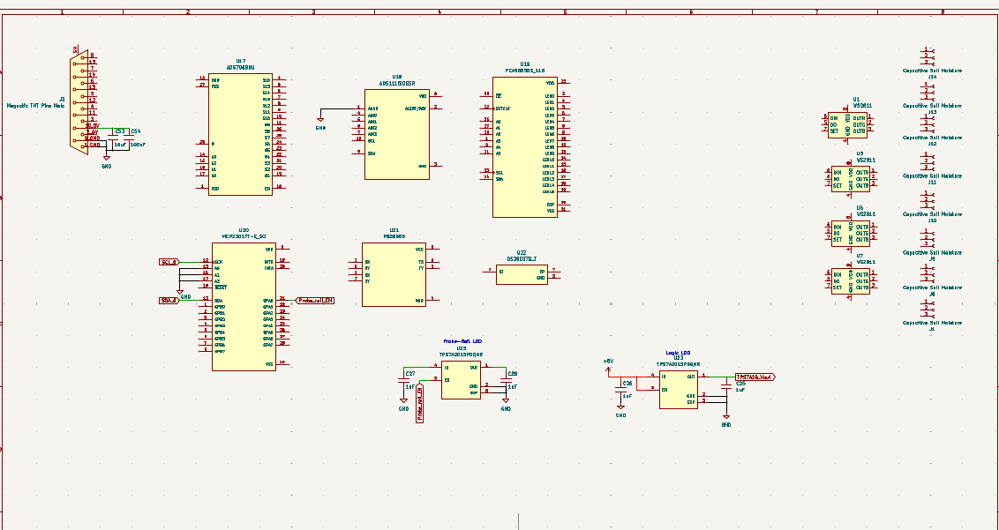

---

## 10. Timelapse - 29.09.2026

After a long week I continue again with this project and in todays (midnight) timelapse even though i am super tired i clocked in some work and in particular i assigned some components and added their peripheral schematics. I also started assigning the GPIO Pins finally so once that is done and connected we will move on to PCBs.

---

**What i did:**

- Added 2 different LDOs for different purposes
- Improved MCU peripheral schematic
- Assigned MCU GPIOs

---

**Problems that i had:**

- Super exhausted and sleepy

---

**Next steps:**

- Finish off peripheral schematics
- Finish off GPIO assignments

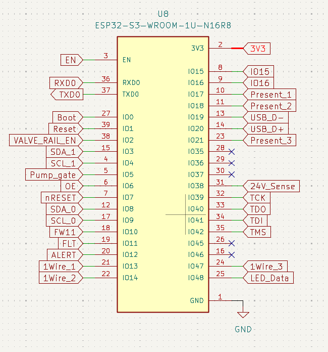
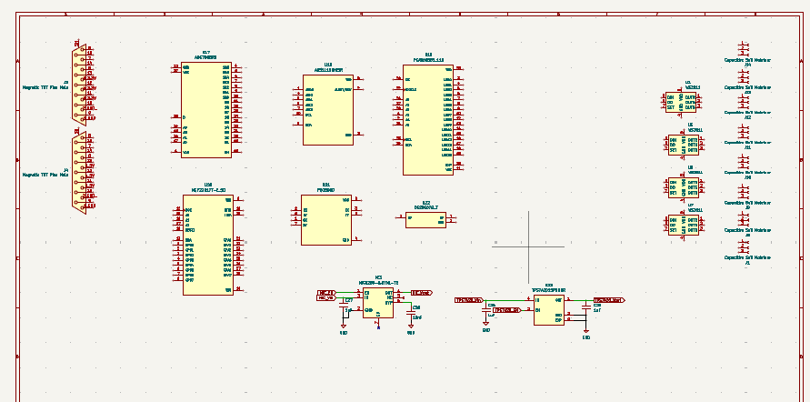

---

## 9. Timelapse - 25.09.2026

Hooooly timelapse.... And lock in. I Cranked up 4 hours in one sitting which closes me out for this week hour requirement so that i can focus on school through out the weekend :)

A lot of stuff have improved today and most important improvement was the ***Input Protection Controller*** because HOOOLLLYYY WAS THAT A COMPLEX IC as it turned out. Behind timelapsing hours i decided to read the documentation and i found out that the recommendations are all flawed, like a lot. And because im a perfectionist i had to upgrade my IC operating efficiency.

This will probably be the last timelapse for Week 2 and so far i am happy of mine and overall our teams progress. For next week i plan on finishing the schematic so that i can start focusing on the Main_PCB 4-layer PCB.

I know it looks dull that i am working for so long on just the schematic but it really is a long process for such a big project.

---

**What i did:**

- Started working on Floor_PCB and added most of the components
- Finished a couple peripheral schematics
- Improved peripheral schematics
- Fixed a lot of errors that i've made previously

---

**Problems that i had:**

- A lot of issues that i had to fix
- Complex IC that required a lot of work
- A lot of multiplexers and expanders are needed

---

**Next step:**

- Continue implementing new components in Floor_PCB
- Finish the schematics in Main_PCB
- Upgrade or fix errors in previous modules

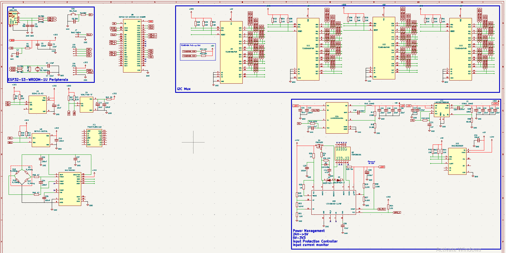
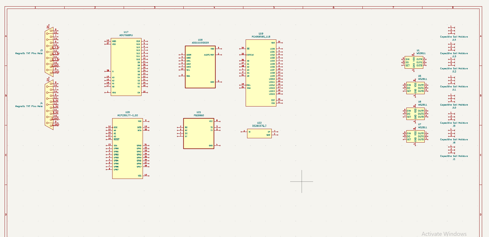
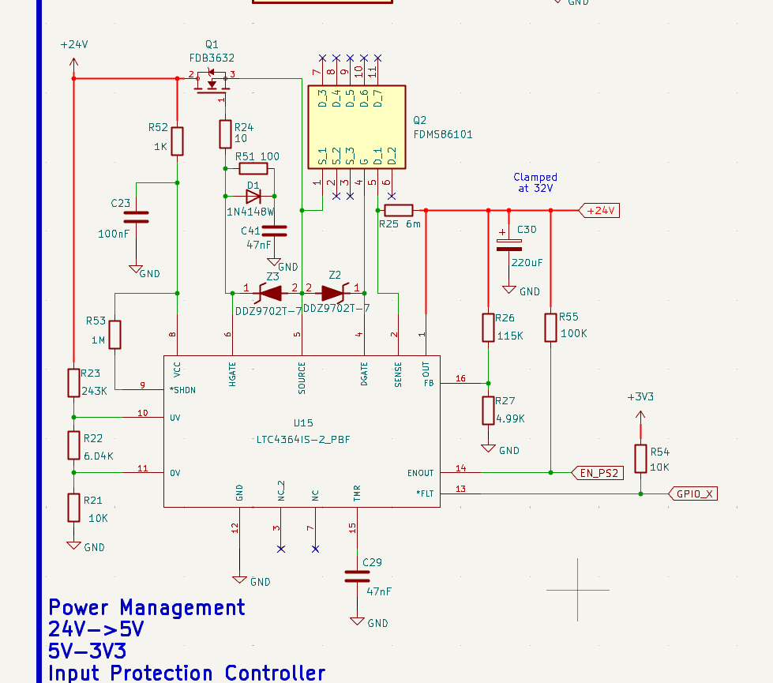

---

## 8. Timelapse - 24.09.2026

Grinded up a bit and i implemented a lot of schematic features. I am still lacking a couple of components tht me and my partner mentioned for this project so i am both implementing and building their environment for efficient workflow.

Also the schematic is starting to recieve its own sections and by the end of it i hope everything is nicely organized and easily readable.

---

**What i did:**

- Added a lot of peripheral components for my modules
- Started implementing new sensors and modules for the project

---

**Problems that i had:**

- Because we are planning on really making this project functional it is hard to know what is too much expensive so i am very often getting lost into how much should i target efficiency or budget-friendly

---

**Next step:**

- There is still a lot of components that need to be added
- A lot of peripheral working left
- Need to assign MCU pins

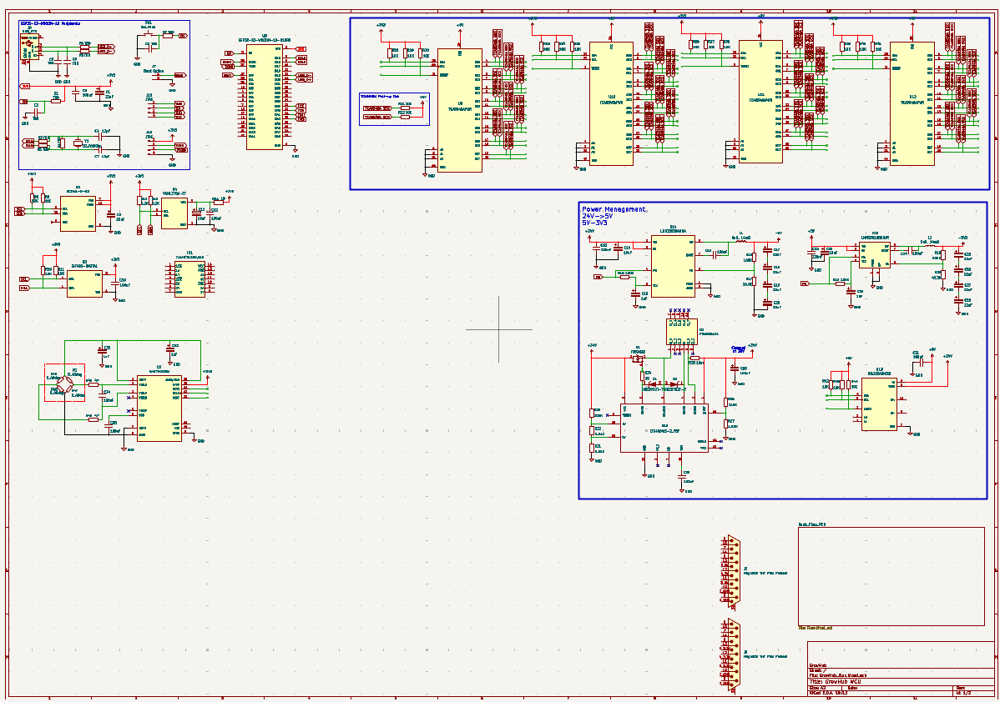
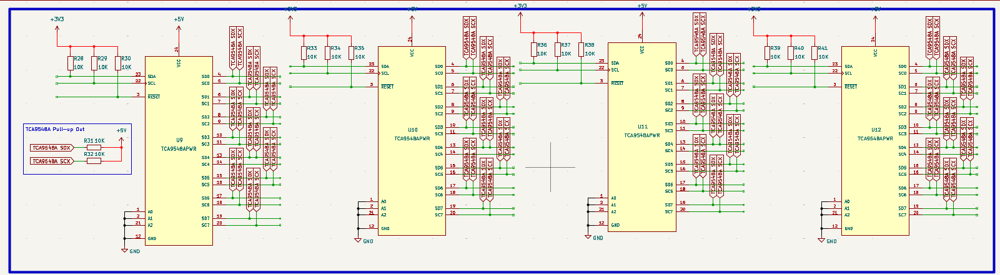
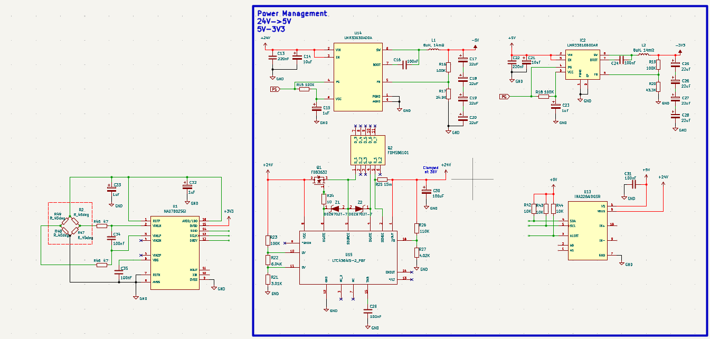

---

## 7. Timelapse - 23.09.2026

A pretty chill day if you ask me considering that i've only assembled passive components around and copied prefered schematics. Ofcourse these recommendations need to be tested at first but that will be possible only after i assign other components.

---

**What i did:**

- Finished a couple modules with their passive component structure

---

**Problems that i had:**

- I am not sure if i have every single passive component integration for the MCU, i will have to double check in my past project but so far it looks ok except the "TBD" value components

---

**Next step:**

- Continue working on the same thing that i am working right now
- Also integrate other peripherals into the schematic

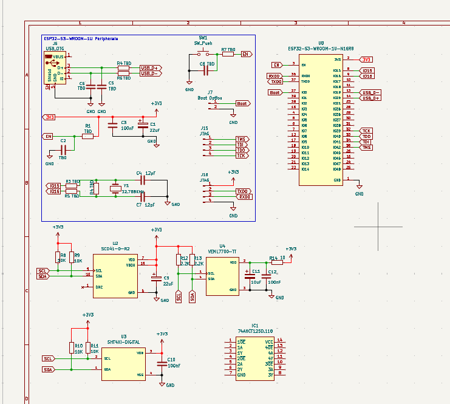
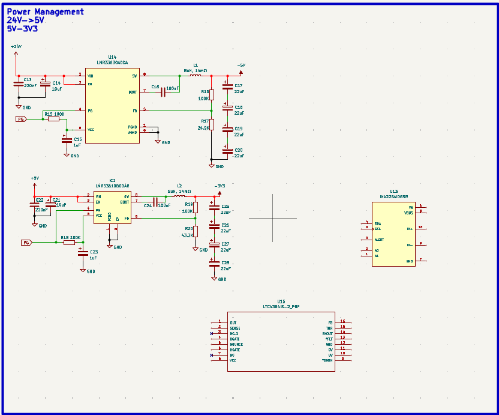
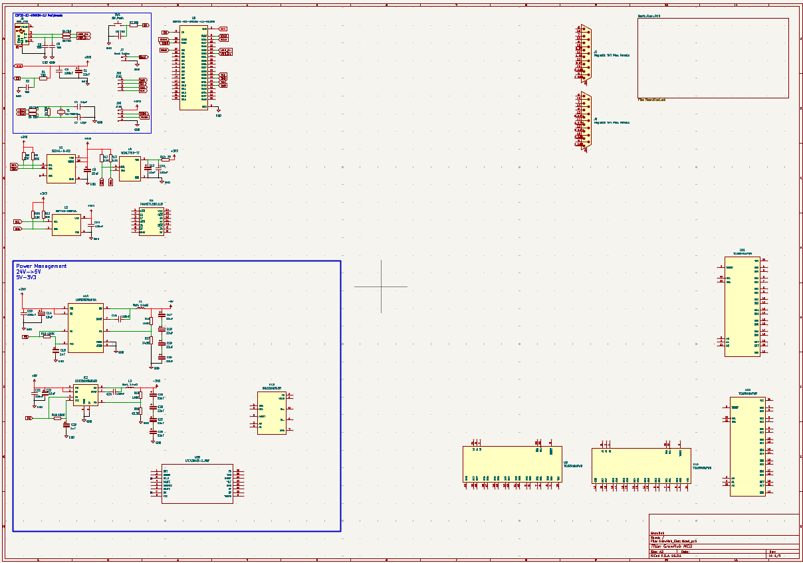

---

## 6. Timelapse - 22.09.2026

Week one has ended!!! Honestly i think that i achieved my bare minimum and i hope that i beat the hour count this week. Even tho i've been up to a busy schedule with life I will try to do more than 12 hours.

We made a slight mistake by shipping it twice with individual screenshots and description so i hope that is not a problem :))))

Anyways here is what i did in this timelapse.

---

**What i did:**

- Started implementing passive components for the modules

---

**Problems that i've faced:**

- Nothing much except the fact that some components are not displayed with values so i will have to read docs while im not timelapsing....
- I forgot to transfer the newest schematic to GitHub and now because im working on my laptop (and not on my PC) because im in a different city i will have to transfer it via screenshare.

---

**Next step:**

- Start adding passive components to other modules

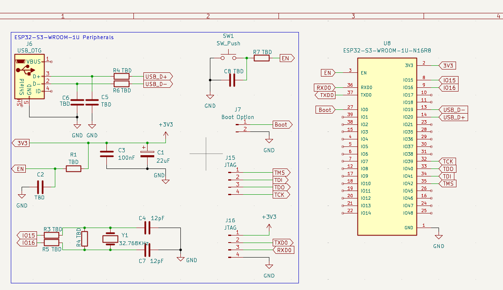

---

  
# ***END OF WEEK 1***

---

## 5. Timelapse - 20.09.2026

I've prepared everything for shipping for this week! A basic README has been constructed in order to have some meaningfull ship for the work that we managed to do in a matter of +20 hours of work on such a big and complex project so please take in notice that we haven't  made a functional project for Week 1.

---

**What i did:**

- Wrote README Week 1

---

**Current State:**

- Finished Week 1
- Ready to ship for a big project

---

**Next Step:**

- Start Week 2
- Have the first functional ship

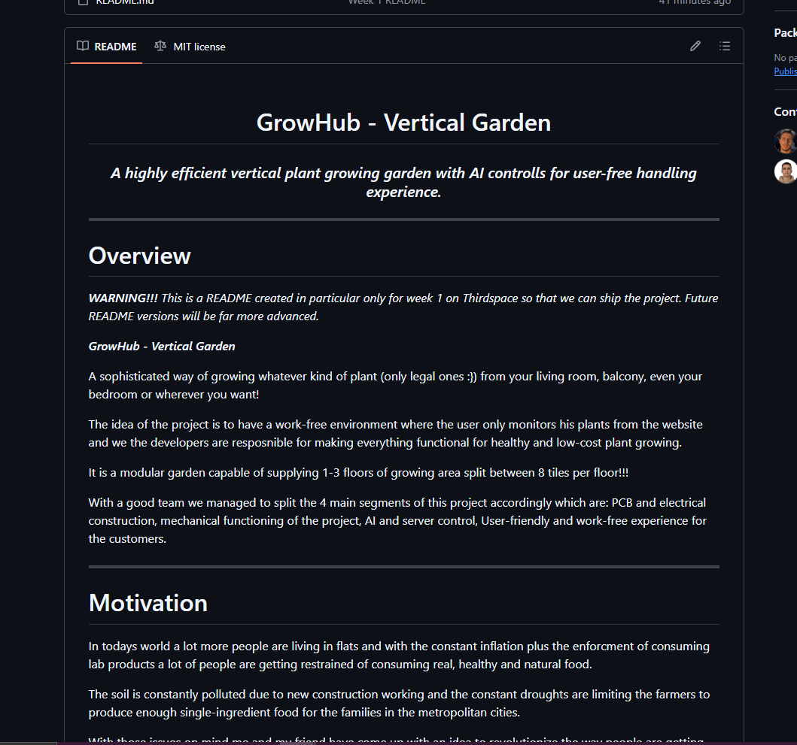

---

## 4. Timelapse - 18.09.2026

Finally i've finished the component hunting for the main pcb *for now*. Saying for now is kinda sad considering i wasted so much time implementing them in kicad and avoiding the regulatory obligation that i can not read documentation while timelapsing and honestly i dont account this time as reading documentation because i've researched dozens of coponents in this hours so it is an efficient time spent working on a project.

---

**What i did:**

- Finalised the first hunt for components
- Made a clear path for a smooth work in KiCAD
- gathered documentation that will help while making the hardware

---

**Problems that i've faced:**

- A lot of components... I know that we still havent explained the project but its sooo complex that a lot of regulations and procedures are required.
- Super technical project

---

**Current State:**

- Ready for building the schematic
- Clear path to work on
- Ready to start working on the other 2 PCBs

---

**Next Step:**

- Agree what type of pump for watering we are gonna use with my teammate
- Start the schematic with passive components
- Create constraints and regulations for my KiCAD project

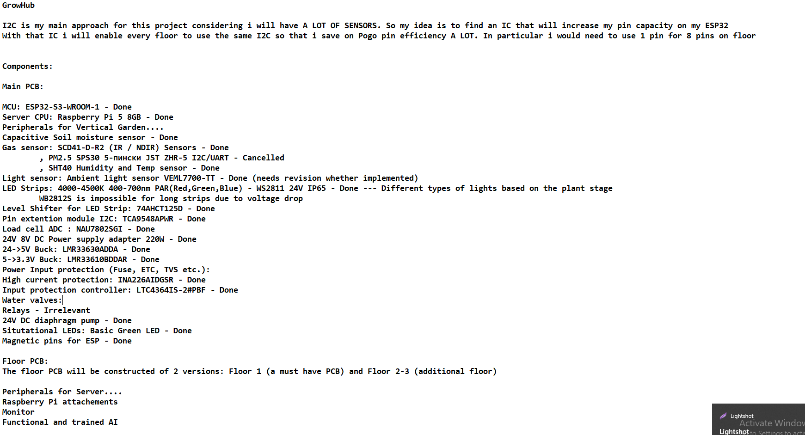
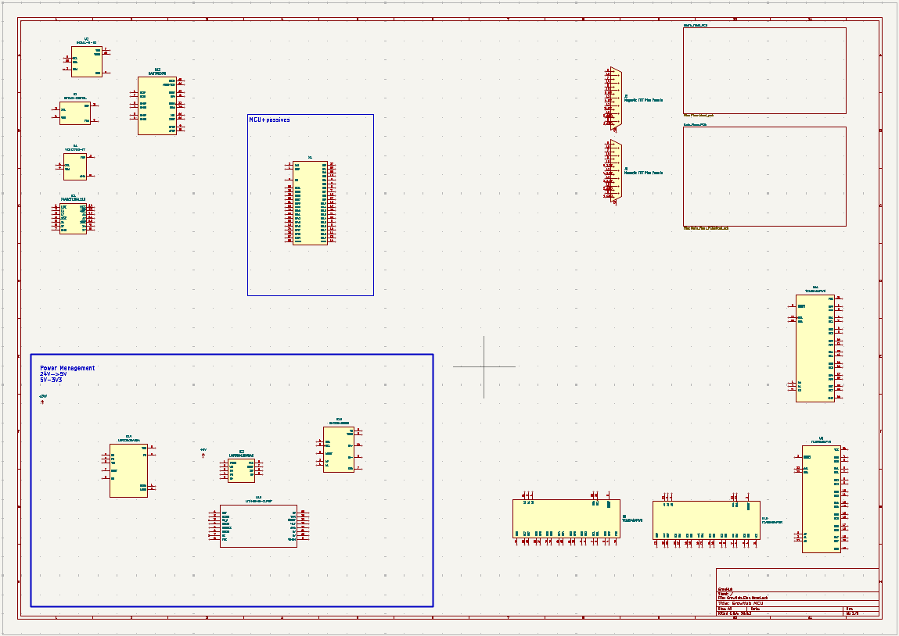

---

## 3. Timelapse - 17.09.2026

Im getting closer to finishing the main PCB component list. I've decided which input voltage i should use. I found every sensors that i need for the first version and now only power management section is left.

I plan for the first week to have every single component that i would need for the main PCB in order to supply the floors with the desired power/signal.

---

**What i did:**

- Finished input/output component selection.
- Found a 24V diaphragm water pump for our project.
- Assigned every component with its coresponding footprint in KiCAD.
- Fixed the issue with my MCU selection.
- Calculated critical power consumption components
- Improved the PCB concept of having 3 versions of PCBs for budget efficiency.

---

**Problems that i've faced:**

- None except the fact that some components caused me a headache whilst trying to find a footprint for them.
- A huge project causes so many aspects to be taken in notice so its really hard to decide where to work first.

--

**Current State:**

- Cleared a lot of uncertainties with the hardware aspect of the project
- Created a clear path for work behind the "scenes" (timelapsing) with my teammate
- Almost prepared my work on KiCAD

---

**Next Step:**

- Resolve the Power Management component question.
- Find watering components that accomodate 24V if possible
- Try and skip 12V in order to be efficient.

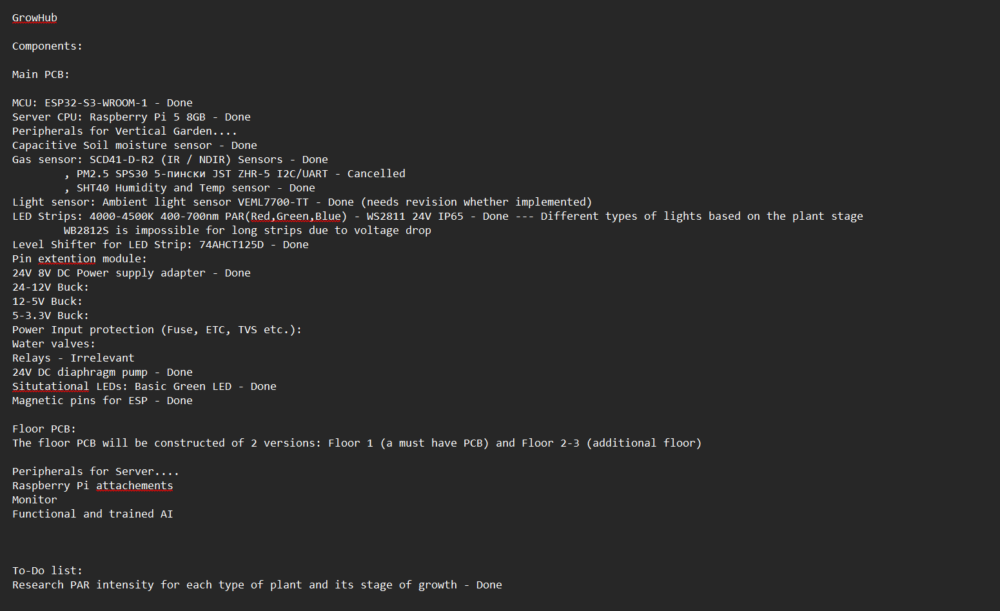
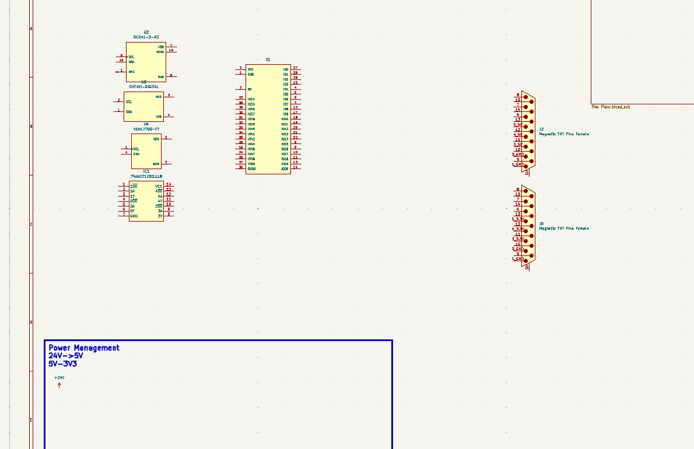
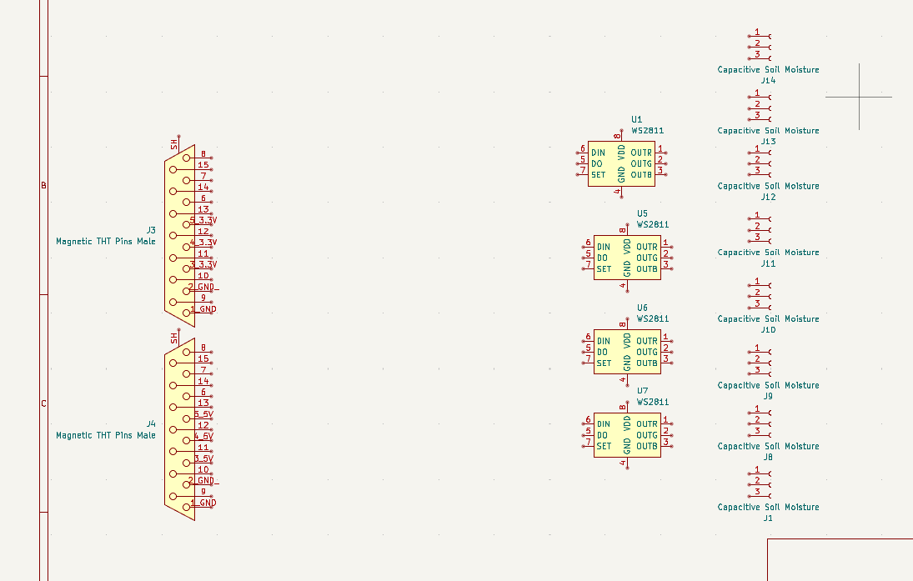

---

## 2. Timelapse - 16.09.2026

Component shopping!!!
Or more accurately the pain of not settling down with 1 module which was so disturbing because of the sheer spectrum that this project is consisted of. I've reserched a lot behind timelapse because i know reading documentation is forbiden but still i had jet lags while timelapsing because i was re-ordering my information in my head.

We've also discussed a lot on how to 3D model and implement the multi-PCB concept all in one so i am really excited so see what it is gonna look like.

---

**What i did:**
In this timelapse which lasted 2 days because yesterday i didnt manage to timelapse for another hour i intended on researching needed components and trying to find them. I am not a biology-person but I tried to research and implement every sensor that is needed for perfecting the growth of one plant.

Researched and read A LOT OF DOCUMENTATION behind timelapse so that i know a bit more about this project

---

**Problems that i've faced**

- A lot of sensors....
- I had so many options that i didnt know what to choose.
- I couldnt really show every work via timelapse becuase some of it was just brainstorming options inside of my head and writing it odwn in notepad in my components list
- The Magnetic Pogo wiring is still a problem and we will need to resolve it with my teammate.

---

**Current State:**

- I've almost picked every essential component that i need for start
- I have made a clear plan behind the scenes on how the electronic scheme should look like (visual imagination :)))
- I've redesigned the schematic and how i plan on doing it.

---

**Next Step:**

- Finish the essential component list
- Start the first version of the schematic.

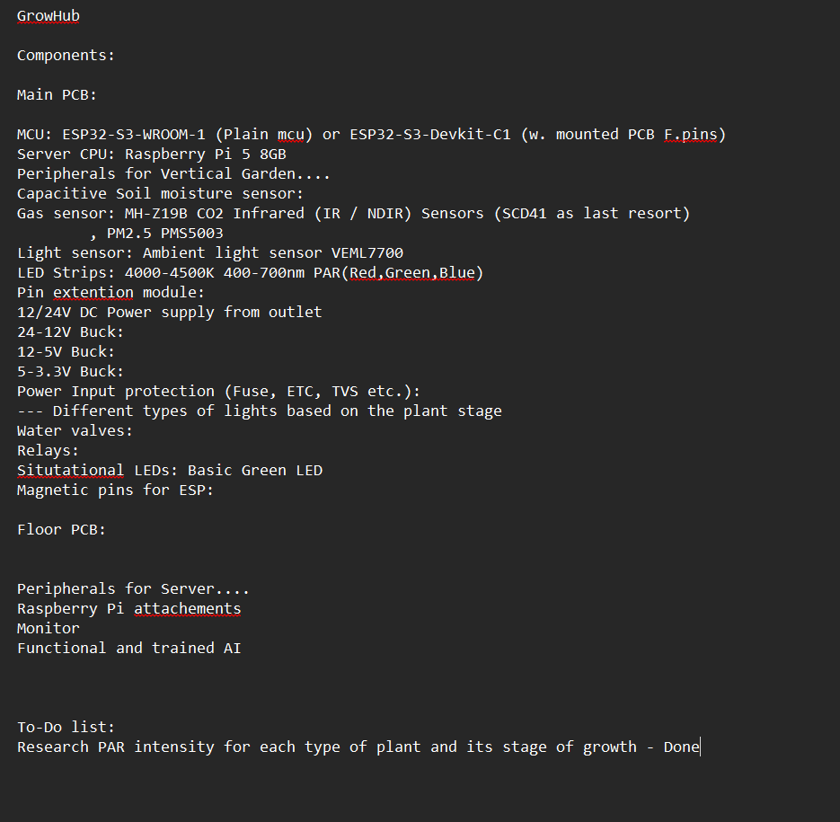
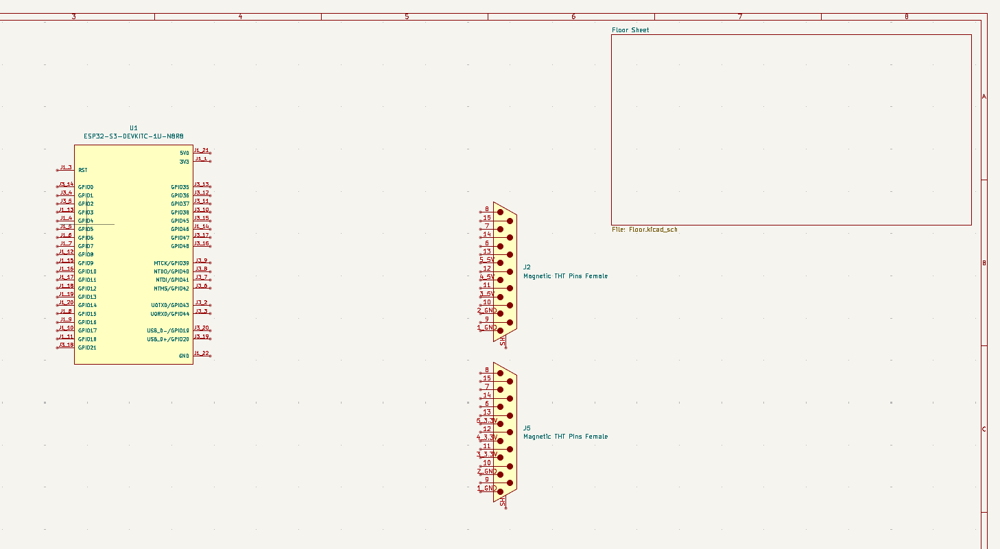
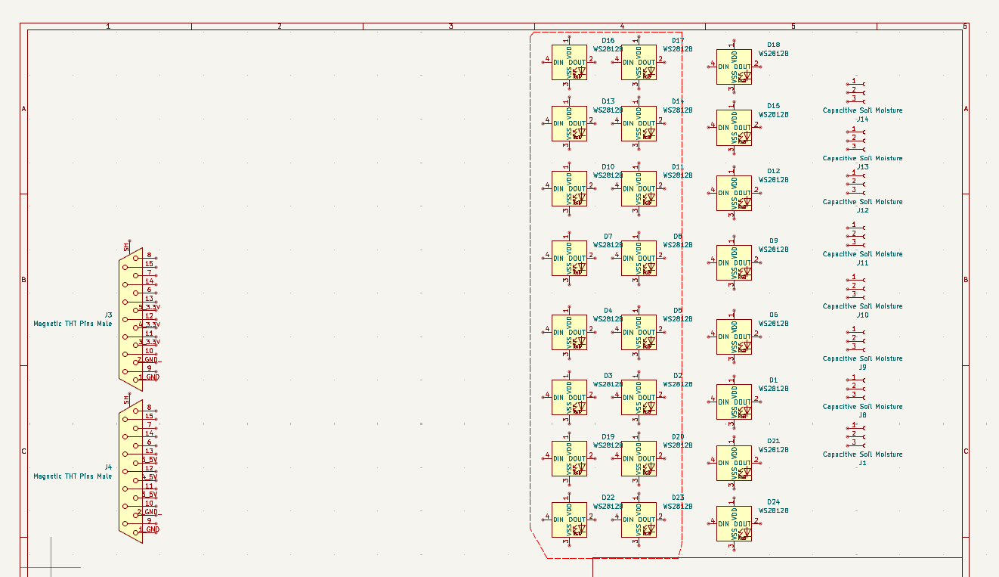

---

## 1. Timelapse - 14.09.2026

Another project has been started in this organization with a lot of plans and goals that need to be accomplished. 

---

**What i did:**

- In this timelapse i did what every normal person (hopefully) would do when they start a project and that is to use your imagination in order to create a sketch that will guide you toward the end product.
- I also created the regular files that i need for shipping a project and prepared files for me and my friend while we journal.
- I have also started looking for components and finding the files for KiCad.
- Because i have been assigned for the hardware and embedded systems it is my job to work on the efficiency of the modules.

Now it's kinda different because i am participating in a team related project called Thirdspace so we have assigned eachother with separate work in order to complete this project:)))

---

**Problems that i've faced**

I fear that as always i will have problems with finding the files to implement into KiCAD and instead i will have to use connectors in order to immitate them.

Slight network problems were existent but that is not a project issue after all.

---

**Current State**

- The starting point has been created from my viewpoint and for my work
- I've prepared the repository for my friend to work inside it also
- Started the schematic
- Started searching for the components

---

**Next Step**

- Finish the component list atleast for 1 floor and basic MCU station
- Create a basic schematic
- Write an MVP code in ESP-IDF
- Test it at home

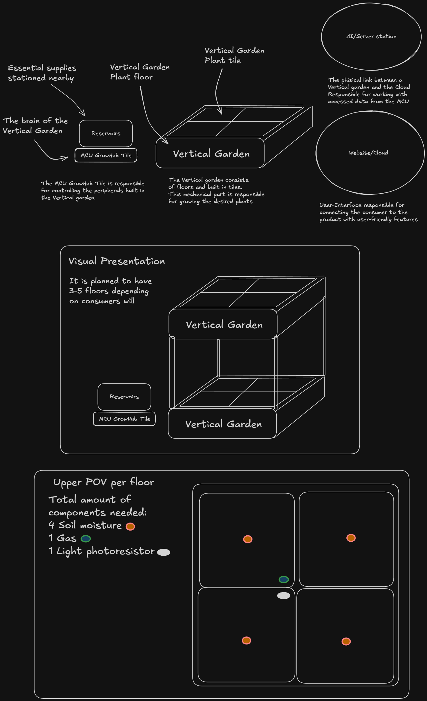
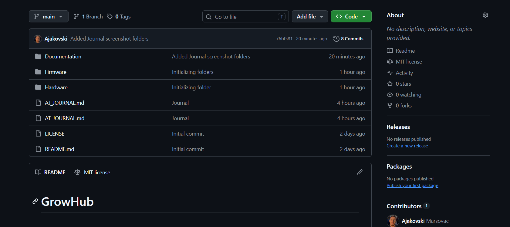
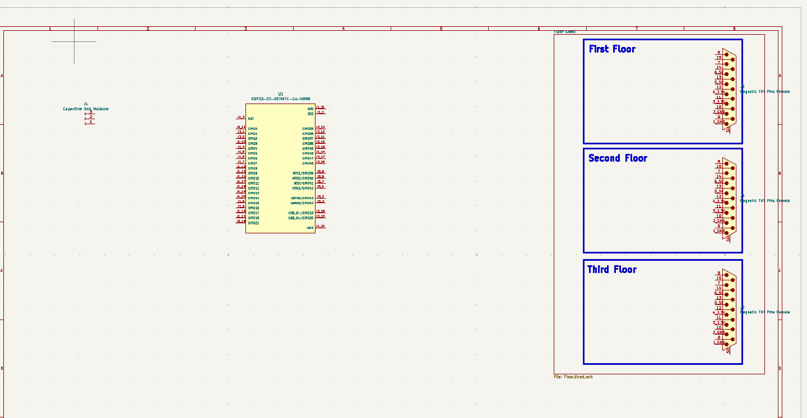

---
